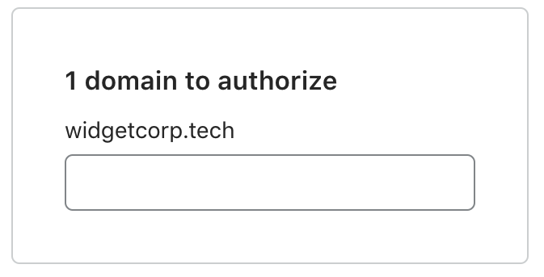

---
order:
pcx-content-type: how-to
---

import BeforeYouBegin from "../_partials/_before-you-begin.md"
import Restrictions from "../_partials/_restrictions.md"
import EmailForward from "../_partials/_email-forward.md"

# How to transfer your domain to Cloudflare

This section contains generic details on how to transfer your domain to Cloudflare from most registrars.

<BeforeYouBegin/>

---

<Restrictions />

<EmailForward/>

---

## Set up a domain transfer

To begin, complete the following steps in your current registrar to transfer your domain to Cloudflare. Below, you will find links for instructions on transfer instructions from some of the most popular registrars:

* [Enom](http://enom.help/outgoing)
* [GoDaddy](https://www.godaddy.com/help/transfer-my-domain-away-from-godaddy-3560)
* [Namecheap](https://www.namecheap.com/support/knowledgebase/article.aspx/258/84/what-should-i-do-to-transfer-a-domain-from-namecheap/)
* [Network Solutions](https://customerservice.networksolutions.com/prweb/PRAuth/webkm/help/article/KC-474/networksolutions)
* [Ionos by 1&1](https://www.ionos.com/help/domains/domain-transfers/#acc4514)

### 1. Login to your registrar account

Log in to the registrar account where the domain is currently registered.

### 2. Unlock the domain

Registrars include a lightweight safeguard to prevent unauthorized users from starting domain transfers: registrar lock. You might also see it written as "domain lock." In WHOIS, it may appear as `clientTransferProhibited`. When enabled, the lock prevents any other registrar from attempting to initiate a transfer.

Only the registrant can enable or disable this lock, typically through the administration interface of the registrar. To proceed with a transfer, remove this lock if it is enabled.

### 3. Remove WHOIS privacy

In most cases, domains may be transferred even if WHOIS privacy services have been enabled. However, some Registrars may prohibit the transfer if the WHOIS privacy service has been enabled.

### 4. Request an authorization code

Your new registrar needs to confirm with your old registrar that the transfer flow is authorized. To do that, your old registrar will provide an authorization code to you. 

<Aside type="note">

This code is often referred to as an authorization code, auth code, authinfo code, or transfer code. You will need to input that code to complete your transfer to Cloudflare. Cloudflare will use it to confirm the transfer is authentic.

</Aside>

### 5. Initiate your transfer

To initiate your transfer, go to the **Account Home** > [**Registrar**](https://dash.cloudflare.com/?to=/:account/domains/transfer). Cloudflare will display the zones available for transfer.

You will be presented with the price for each transfer. When you transfer a domain, you are required by ICANN to pay to extend its registration by one year from the expiration date. You can remove domains from your transfer by selecting **x**.

If you do not have a payment method on file, add one at this step before proceeding.

Sites can be unavailable for a few reasons, including:

* The site was registered in the last 60 days.
* Cloudflare does not yet support the TLD.
* The domain is designated as a “Premium” domain by the Registry.
* The domain has a status that does not allow for a transfer.

You will not be billed at this step. Cloudflare will only bill your card when you input the auth code and confirm the contact information at the conclusion of your transfer request.

<Aside type="note">

If you have an <a href='https://support.cloudflare.com/hc/articles/203471284#h_1l0KGygoBX9QYjNrhAcHjg'>unverified account email address</a>, you will not be able to transfer domains. Please verify your account email address before proceeding.

</Aside>

### 6. Input your authorization code

In the next page, you need to input the authorization code for each domain you are transferring. You also need to unlock each domain so that Cloudflare can process your request. For more information, refer to the instructions provided by your [current registrar on how to transfer your domain](/setup-domain-transfers/transfer-domain-to-cloudflare#set-up-a-domain-transfer).

### 7. Confirm or input your contact information

In the final stage of the transfer process, you need to input the contact information for your registration. Cloudflare Registrar redacts this information by default, but we are required to collect the authentic contact information for this registration. It is important that you provide accurate WHOIS contact information. You may be required to verify the contact information. Failure to provide accurate information and/or failure to verify the information may result in suspension or deletion of your domain.

You can modify the contact information, if needed, in the **Manage** tab [in your acount](/why-choose-cloudflare/whois-redaction#what-is-whois-redaction).

After entering the contact information, you need to agree to the domain registration terms of service by selecting **Confirm transfer**.

### 8. Approve the transfer with your previous registrar

Once you have requested your transfer, Cloudflare will begin processing it. Your previous registrar will email you to confirm your request to transfer away. Most registrars will include a link to confirm the transfer request. If you click that link, you can accelerate the transfer operation. If you do not act on the email, the registrar can wait up to five days to process the transfer to Cloudflare. You may also be able to approve the transfer from within your current Registrar dashboard.

## Transfer statuses

You can check on the status of your transfer from the **Overview** page for that domain in the Cloudflare dashboard. Below, you can find a list of the possible transfer statuses.

* **Transfer in progress**: your request has been submitted by Cloudflare to your previous registrar. We are now waiting on them to confirm they have received the request. If this status persists for more than one day, please ensure that the domain has been unlocked at your current registrar and any WHOIS privacy services have been removed.

* **Pending approval**: your current registrar has received the transfer request. They can now wait up to five days to release the domain. If you want to move faster, you can manually approve the transfer for immediate release in the UI of most registrars.

* **Transfer rejected**: your transfer has been rejected. This can occur if you cancelled the request at your current registrar instead of approving it. If you still wish to transfer, you can select **Retry** and initiate a new transfer request.